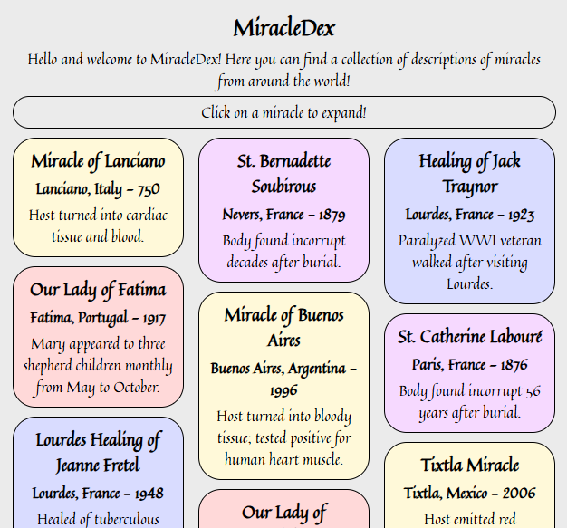
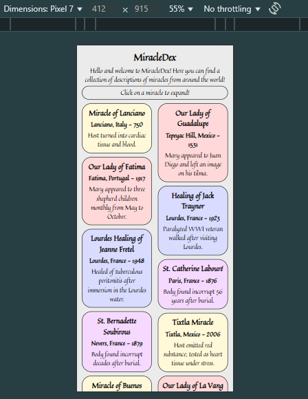
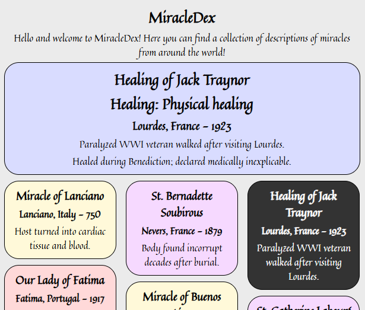

# ✨ MiracleDex Project Report

**Student Name:**  Michael Martinez

**Course:** CSCI 270 – Web/Mobile App Development

**Project Title:** MiracleDex

**Submission Date:**  6/11/2025

**GitHub Repo:** [GitHub](https://github.com/AragornFire/miracledex)

**Live Site (GitHub Pages):** [MiracleDex](https://aragornfire.github.io/miracledex/)

**ChatGPT Help:** [Fixing masonry and failed mobile media queries](https://chatgpt.com/share/68488080-12c8-800d-8396-d5b09c4ddbd5)

---

## 🔷 Part 1 — HTML/CSS Layout and Responsive Design

### ✅ Requirements Addressed
- [x] Landing page created with heading and container
- [x] Used Flexbox or Grid layout
- [x] Mobile-friendly design with media queries
- [x] Elegant, reverent styling with a Google Font
- [x] External CSS file used

### 📸 Screenshots



### 🔍 Code Snippets
```html
<!-- Most relevant code is generated by JavaScript, which would look like this: -->
<div id="15" class="brick healing">
  <h3>Healing of Anna Santaniello</h3>
  <h4>Italy - 1952</h4>
  <p>Healed of severe heart disease during pilgrimage to Lourdes.</p>
</div>
```
```css
.brick {
    break-inside: avoid;
    padding: 5px;
    box-sizing: border-box;
    margin-bottom: 10px;

    border: 1px solid black;
    border-radius: 25px;

    transition: background-color 200ms, color 200ms;
}
.brick:hover:not(.display) {
    background-color: #333333;
    color: white;
    cursor: pointer;
}
.wall {
    column-count: 3;
    @media (max-width: 480px) {
        column-count: 2;
    }
    @media (max-width: 380px) {
        column-count: 1;
    }
}
.apparition {
    background-color: #ffd9d9;
}
.healing {
    background-color: #d9dcff;
}
.eucharistic {
    background-color: #fff9d9;
}
.incorruptible {
    background-color: #f6d9ff;
}
```

### 🖋️ Reflection
What challenges did you face in designing a responsive layout?
What did you learn about structuring HTML/CSS for real-world use? 

> I can't say I encountered any difficulties making my site responsive.
> The contents of the site work well regardless of the screen size.
> The only thing I ended up changing was the number of columns.
> I didn't like how it looked when I had one column on mobile, so I made it two instead.
> I think the longer boxes look nicer than the wide ones, and the rest of the content works well at any size.
> 
> I think I learned that I shouldn't avoid `div`s that much.
> I remember when I was younger scouring through a site's HTML and being confused by the amount of `div`s.
> Now, I recognize that they help organize the content of the site well.

---

## 🔷 Part 2 — JavaScript + DOM + JSON Integration

### ✅ Requirements Addressed
- [x] Fetched data from:  
  `https://gist.githubusercontent.com/trevortomesh/7bbf97b2fbae96639ebf1a254b6a7a70/raw/miracles.json`
- [x] Rendered miracle title, location, year, summary
- [x] Used `fetch()` and `async/await`
- [x] Implemented "Load More" or pagination
- [x] Added modal or expandable section with full miracle details

### 📸 Screenshots


### 🔍 Code Snippets
```javascript
async function loadMiracles () {
	const res = await fetch("https://gist.githubusercontent.com/trevortomesh/" +
		"7bbf97b2fbae96639ebf1a254b6a7a70/raw/miracles.json");
	const data = await res.json();
	console.log(data);
	renderMiracles(data, "first"); // Go to the first page
	return data;
}

loadMiracles().then((data) => {globalThis.miracles = data;});

function makeHTMLElement (pair) {
	const elem = document.createElement(pair[0]);
	elem.textContent = pair[1];
	return elem;
}

function displayBrick (id) {
	const brick = document.getElementById(id);
	const display = document.getElementById('display');
	const miracle = globalThis.miracles[parseInt(brick.id) - 1];
	//console.log(data); // Debugging

	display.classList = brick.classList; // Should have the same styling
	display.classList.add('display'); // This is used to avoid the hovering style change
	display.innerHTML = ''; // Clear out element

	[['h1', miracle.title], ['h2', miracle.type + ': ' + miracle.category],
		['h3', miracle.location + ' - ' + miracle.year], ['p', miracle.summary],
		['p', miracle.details]].forEach(pair => {
		display.appendChild(makeHTMLElement(pair)); // Add all the elements
	});
}

const subclasses = { // Subclasses for special coloring
	"Apparition": "apparition",
	"Healing": "healing",
	"Eucharistic": "eucharistic",
	"Incorruptible": "incorruptible"
}

function renderMiracles (data, half) {
	const wall = document.getElementById("wall");
	wall.innerHTML = ""; // Clear out the contents for pagination
	let myData = []; // Used for slicing
	const midpoint = Math.floor(data.length / 2); // Save code
	if (half === "first") {
		myData = data.slice(0, midpoint);
	} else if (half === "second") {
		myData = data.slice(midpoint, data.length);
	} else {
		alert("Error in determining which page to load!") // Should always be there
	}

	myData.forEach(miracle => {
		const brick = document.createElement('div');
		brick.id = miracle.id; // For showing at the top of the page
		brick.classList.add('brick');
		brick.classList.add(subclasses[miracle.type]); // Special coloring

		[['h3', miracle.title], ['h4', miracle.location + ' - ' + miracle.year],
			['p', miracle.summary]].forEach(pair => {
			brick.appendChild(makeHTMLElement(pair)); // Add all the elements
		});

		// For putting them at the top of the page
		brick.addEventListener('click', () => {displayBrick(brick.id)});

		wall.appendChild(brick);
	})
}

const buttons = document.getElementsByTagName('button');
for (let button of buttons) { // Add paging functionality to buttons
	button.addEventListener('click', () => {renderMiracles(miracles, button.id)});
}
```

### 🖋️ Reflection
What did you learn about asynchronous JavaScript?
What debugging techniques did you use or discover?

> One tricky thing that I noticed was that you need extra steps to use the data in a Promise.
> I kept running into `undefined` when I tried indexing the data.
> I looked into it and learned you need to use `.then()` to store the data.
> Even then, however, any variables I defined would be a local variable.
> How neat that `globalThis` exists then!
> 
> Most of my code worked first try, funnily enough.
> There weren't many occasions when I actually had an error.
> A lot of it I was able to fix with the Problems window in WebStorm.
> If the issue was with an object, I'd log it to the console and examine it.
> Otherwise, Google searches helped a lot.

---

## 🔷 Part 3 — GitHub Repository and Documentation

### ✅ Requirements Addressed
- [x] GitHub repo created and pushed
- [x] GitHub Pages deployed
- [x] `README.md` contains project description, instructions, and screenshots

### 📎 Links
- **GitHub Repo:** [GitHub](https://github.com/AragornFire/miracledex)
- **Live GitHub Pages Site:** [MiracleDex](https://aragornfire.github.io/miracledex/)

### 🖋️ Reflection
How did using GitHub affect your development process?
What new Git or GitHub skills did you gain?

> I had some confusion before I realized I had never made an actual GitHub repository.
> I was under the assumption that it was created automatically when I made the project.
> Ultimately I figured that out and I don't think it affected me besides that minor hiccup.
> I'm used to dealing with everything just on my machine, which might mean I'm more accustomed to how to fix accidental code losses.
> 
> I think I became better at writing comments and commit messages.
> Normally I'm just writing for myself because nobody really cares to use the code I write.
> However, with this exercise I exercised that undeveloped muscle.

---

## 🧠 Final Reflection

Imagine you're explaining this project to a friend who doesn’t code. What does your app do? What are you most proud of? What was the hardest part to get working?

> "So here you have a bunch of blocks that have details of miracles.
> When you click on one, the miracle's info gets expanded and appear in this top box.
> You can also look at more miracles if you click on this button.
> 
> "I'm really proud of how I made the different types of miracles have different colors.
> Also, at first all the blocks would snap immediately to dark gray when you hovered.
> I figured out how to make that happen nice and smoothly.
> 
> "I'm also surprised by how easy it was to do.
> Maybe my perspective is skewed by my experience programming, but it only took me two days.
> I did even lose hair over this!"

Reflect on both the technical and the spiritual aspects of building a project about Catholic miracles.

> I think, compared to Acutis's Miracoli Eucaristici, it's very simple.
> However, I can see, as a project he devoted a lot of his time to, the steps that he probably took to get from where my code is to his.
> There are so many miracles that it feels like a noble endeavor to try to catalog them.
> 
> I've long had fleeting moments of ambition where I want to catalog something for posterity or simply to share.
> One of those things was variations in how parishes sing different parts of the Mass.
> I've noticed that recent the Gloria I always heard when I was younger isn't the same as that my parish sings today.
> I've also noticed how everyone around me would say 'Maker' in the Apostles' Creed when I would say 'Creator'.
> Before it would've seemed impossible to record all that I would want.
> Now, it seems that all that is stopping me is my ambition.

---

<sub>Assignment created by Dr. Trevor Tomesh with assistance from ChatGPT. All source miracle data provided from public JSON: https://gist.github.com/trevortomesh/7bbf97b2fbae96639ebf1a254b6a7a70</sub>